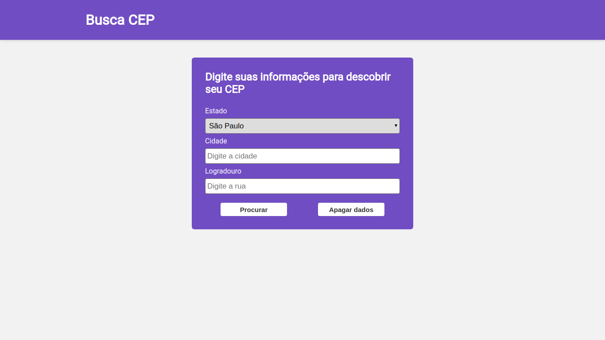
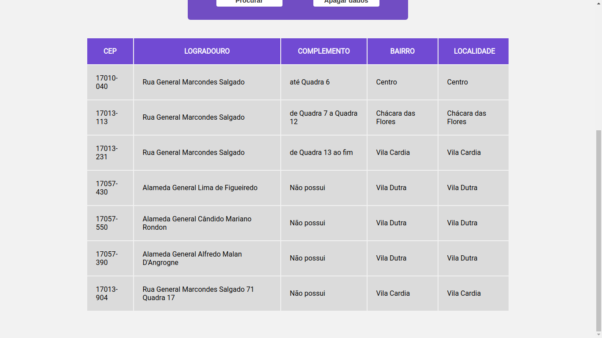
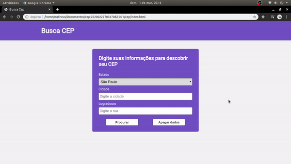

# BuscaCep

# `Resumo`

Aplicação web desenvolvida como trabalho de aula usando html, css, javascript,jquery e a api do ViaCep.
Site para encontrar seu CEP utilizando seu estado, cidade e endereço.

# `Resultado`

## Tela de inserção de dados

## Tabela de resultados

## Em Pratica

